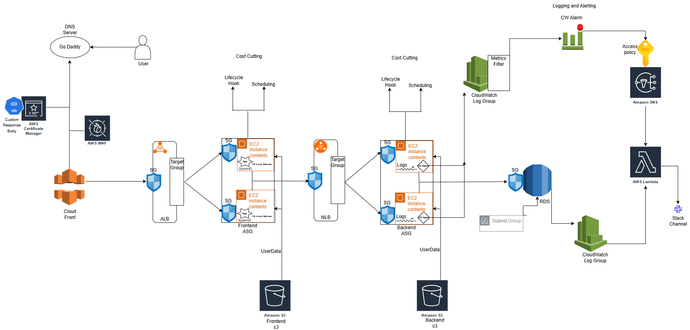

# 🚀 FULL STACK AWS PROJECT – END TO END FROM SCRATCH

Production-grade full stack deployment on AWS with high availability, monitoring, scaling, CDN, and security hardening.

---

# Architecture Diagram

---

# 🔷 PHASE 1 — NETWORK FOUNDATION

## 1️⃣ Create VPC

**Name:** dev-vpc  
**CIDR:** 10.0.0.0/16  

This isolates your entire infrastructure inside a private virtual network.

---

## 2️⃣ Create Subnets (Multi-AZ)

### Public Subnets (For ALB & NAT)

- 10.0.0.0/24  (us-east-1a)  
- 10.0.1.0/24  (us-east-1b)  
- 10.0.2.0/24  (us-east-1c)  

### Private Subnets (For EC2 Application)

- 10.0.3.0/24  
- 10.0.4.0/24  
- 10.0.5.0/24  

Multi-AZ design ensures high availability.

---

## 3️⃣ Internet Gateway

Create Internet Gateway → Attach to VPC  

Purpose:  
Allows public subnets to access the internet.

---

## 4️⃣ NAT Gateway

Create NAT Gateway in a Public Subnet  
Attach an Elastic IP  

Purpose:  
Private instances can access the internet (SSM, S3, updates) without being publicly exposed.

---

## 5️⃣ Route Tables

### Public Route Table

    0.0.0.0/0 → Internet Gateway

Attach to Public Subnets.

### Private Route Table

    0.0.0.0/0 → NAT Gateway

Attach to Private Subnets.

---

# 🔷 PHASE 2 — SECURITY LAYER

## 6️⃣ Create Security Groups

### ALB SG
Inbound: Port 80 from 0.0.0.0/0

### Frontend SG
Port 8501 from ALB SG

### NLB SG (Internal)
TCP 80 from Frontend SG

### Backend SG
Port 8084 from NLB SG

### RDS SG
Port 3306 from Backend SG

Layered security ensures:
- No backend exposure
- No database public access
- Strict east-west traffic control

---

# 🔷 PHASE 3 — DATABASE

## 7️⃣ Create RDS (MySQL)

Engine: MySQL  
Multi-AZ: Recommended  
Subnets: Private only  
Public Access: Disabled  
Encryption: Enabled (KMS)  

Save the RDS endpoint for application configuration.

---

# 🔷 PHASE 4 — SECRETS MANAGEMENT

## 8️⃣ Store DB Credentials in Parameter Store

Create parameters:

    /cheetah/dev/mysql/host
    /cheetah/dev/mysql/username
    /cheetah/dev/mysql/password (SecureString)

Encryption:

- aws/ssm  
  OR  
- Custom KMS key  

Ensures no hardcoded credentials in code or user data.

---

# 🔷 PHASE 5 — S3 FOR APPLICATION ARTIFACTS

## 9️⃣ Create S3 Buckets

- cheetah-dev-be-app-bucket  
- cheetah-dev-fe-app-bucket  

Upload:

- Backend JAR  
- Frontend app.py  

---

# 🔷 PHASE 6 — IAM ROLES

## 🔟 Create IAM Role for EC2

Attach Policies:

- AmazonSSMManagedInstanceCore  
- CloudWatchAgentServerPolicy  
- AmazonS3ReadOnlyAccess  
- ssm:GetParameter  
- kms:Decrypt  

Attach this role to EC2 via Launch Template.

---

# 🔷 PHASE 7 — BACKEND DEPLOYMENT

## 1️⃣1️⃣ Create Launch Template (Backend)

Include:

- Amazon Linux  
- Instance Type  
- IAM Role  
- User Data script  

### Backend User Data Performs:

- Install Java  
- Install CloudWatch Agent  
- Fetch DB credentials from SSM  
- Download JAR from S3  
- Start Spring Boot application  
- Configure log shipping  

Log Path:

    /var/log/app/datastore.log

---

## 1️⃣2️⃣ Create Backend Target Group

Protocol: TCP  
Port: 8084  
Health Check Protocol: HTTP  
Health Check Path: /actuator  

---

## 1️⃣3️⃣ Create Internal NLB

- Attach Private Subnets  
- Attach Backend Target Group  

---

## 1️⃣4️⃣ Create Backend Auto Scaling Group

- Launch Template  
- Private Subnets  
- Attach to NLB  
- Desired Capacity: 1  
- Health Check Type: ELB  

---

# 🔷 PHASE 8 — FRONTEND DEPLOYMENT

## 1️⃣5️⃣ Create Launch Template (Frontend)

User Data performs:

- Install Python  
- Create virtual environment  
- Install streamlit  
- Download app.py from S3  
- Create systemd service  
- Set API_URL to Backend NLB DNS  
- Start service  

Runs on:

Port 8501

---

## 1️⃣6️⃣ Create Frontend Target Group

Protocol: HTTP  
Port: 8501  

---

## 1️⃣7️⃣ Create Application Load Balancer

- Public Subnets  
- Attach Frontend Target Group  
- Listener: HTTP 80  

---

## 1️⃣8️⃣ Create Frontend Auto Scaling Group

- Private Subnets  
- Attach to ALB  
- Health Check Type: ELB  

---

# 🔷 PHASE 9 — MONITORING & ALERTING

## 1️⃣9️⃣ CloudWatch Log Group

Created by CloudWatch Agent:

    /datastore/app

---

## 2️⃣0️⃣ Create Metric Filter

Pattern:

    ERROR

Namespace:

    be-cw-ns

Metric Name:

    log-error

---

## 2️⃣1️⃣ Create CloudWatch Alarm

Condition:

    log-error >= 1

Period: 1 minute  

Action:

Publish to SNS

---

## 2️⃣2️⃣ Create SNS Topic

Type: Standard  

Access Policy:

Allow only:

    cloudwatch.amazonaws.com

With Condition:

    SourceArn = specific alarm ARN

---

## 2️⃣3️⃣ Create Lambda Function

Runtime: Python 3.12  

Environment Variable:

    slackHookUrl

### Lambda Logic

- Receive SNS event  
- Parse AlarmName  
- Send Slack webhook message  

---

## 2️⃣4️⃣ Subscribe Lambda to SNS

SNS → Subscription → Lambda  

Test:

Manually insert log line:

    ERROR test

Slack receives alert successfully.

---

# 🔷 PHASE 10 — CDN + SECURITY HARDENING

## 2️⃣5️⃣ Create CloudFront Distribution

Origin:

    ALB DNS

Viewer Protocol Policy:

    Redirect HTTP to HTTPS

---

## 2️⃣6️⃣ Configure WebSocket Headers

Origin Request Policy:

- Host  
- Origin  
- Sec-WebSocket-Key  
- Sec-WebSocket-Version  
- Sec-WebSocket-Extensions  

OR  

Forward All Viewer Headers

---

## 2️⃣7️⃣ Add AWS WAF

Create Web ACL  

Rules:

- IP Block  
- Geo Restriction  
- AWS Managed Rules  

Add Custom 403 HTML Response (styled page).  

Attach WAF to CloudFront.

---

# 🔷 PHASE 11 — DNS

## 2️⃣8️⃣ Add Custom Domain

Using Route53 or GoDaddy:

    CNAME → CloudFront domain
    TTL → 600

Attach ACM certificate for HTTPS.

---

# 🔷 PHASE 12 — AUTO SCALING OPTIMIZATION

## 2️⃣9️⃣ Add Scaling Policies

- Target Tracking (CPU 50%)  
- Step Scaling  

---

## 3️⃣0️⃣ Add Scheduled Actions (Cost Optimization)

Example:

Scale Down at Night:

    Capacity: 0
    Cron: 0 19 * * ?

Scale Up in Morning:

    Capacity: 1
    Cron: 0 6 * * ?

---

# 🔷 FINAL ARCHITECTURE FLOW

## Application Flow

    User
      ↓
    CloudFront
      ↓
    WAF
      ↓
    ALB
      ↓
    Frontend ASG
      ↓
    Internal NLB
      ↓
    Backend ASG
      ↓
    RDS

---

## Monitoring Flow

    Backend Logs
      ↓
    CloudWatch
      ↓
    Metric Filter
      ↓
    Alarm
      ↓
    SNS
      ↓
    Lambda
      ↓
    Slack

---
